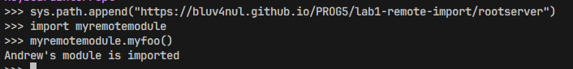
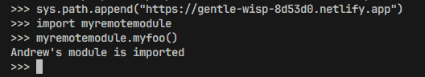

# Лабораторная работа 1. Импорт удаленных модулей.

Выполнил Фролов.А.А.

## Шаг 1. Собственный модуль.

На этом шаге мы создаем свой модуль с функцией заглушкой.

```python
def myfoo():
    print(...)
```

Затем мы создаем файл activation_script.py куда помещаем реализацию хука импорта по URL: загрузчик (loader), искатель (finder) и сам хук, который регистрируется в `sys.path_hooks`.

```python
class URLLoader:
    """Скачивает исходник модуля по URL и выполняет его."""

    def create_module(self, target):
        """None — модуль создаётся стандартным способом."""

    def exec_module(self, module):
        """Качает код по origin и выполняет его в пространстве имён модуля."""


class URLFinder(PathEntryFinder):
    """Знает, какие модули лежат по одному URL-адресу."""

    def __init__(self, url, available):
        """Запоминает базовый URL и набор доступных имён модулей."""

    def find_spec(self, name, target=None):
        """Спецификация модуля с URLLoader, если имя есть по этому URL, иначе None."""


def url_hook(some_str):
    """Для http-элемента sys.path строит URLFinder, иначе ImportError."""


sys.path_hooks.append(url_hook)
```

Запускаем модуль на сервере (`python -m http.server` из каталога `rootserver`), в другом терминале запускаем активирующий скрипт локально в интерактивном режиме (`python -i activation_script.py`), пробуем сделать импорт:


Получаем ошибку `ModuleNotFoundError`: хук уже зарегистрирован, но адреса сервера нет в `sys.path`, поэтому искать модуль по HTTP интерпретатору негде.

Затем выполняем команду

```python
sys.path.append("http://localhost:8000")
```

и пробуем сделать импорт снова.


Все успешно. Теперь для нового элемента `sys.path` срабатывает `url_hook`, он забирает у сервера список файлов и возвращает `URLFinder`; тот отдаёт спецификацию с `URLLoader`, который скачивает и выполняет исходник. Вызов `myremotemodule.myfoo()` печатает `Andrew's module is imported` — код действительно приехал с сервера.

## Шаг 2. Иной хостинг.

Сам скрипт менять не нужно: механизм не зависит от того, кто именно отдаёт файлы по HTTP — меняется только адрес в `sys.path.append(...)`.

### GitHub Pages

Сначала проверим на примере GitHub Pages. Добавляем минимальный файл `index.html` в папку `rootserver` — у статических хостингов нет автолистинга каталога, а `url_hook` вытаскивает имена модулей регуляркой со страницы, поэтому список файлов надо отдать ему самим. В корень репозитория кладём пустой `.nojekyll`, чтобы Pages выкладывал файлы как есть. Затем на GitHub деплоим с ветки (Settings → Pages → Deploy from a branch). Итоговый адрес будет вида:

`https://bluv4nul.github.io/PROG5/lab1-remote-import/rootserver`

Опять же запускаем в интерактивном режиме файл activation_script.py и пробуем импортировать модуль



Все получилось успешно. Слэш на конце адреса не ставим: хук склеивает путь как `{url}/{name}.py`, и лишний слэш дал бы 404.

### Netlify Drop

Хостинг супер простой - просто перетаскиваем папку rootserver в браузер и получаем ссылку:

`https://gentle-wisp-8d53d0.netlify.app`

Здесь `index.html` уехал на хостинг вместе с модулем, так что готовить ничего не пришлось. Пробуем импортировать модуль с этого хостинга:



Все успешно. На обоих хостингах результат одинаковый и совпадает с локальным сервером из шага 1: механизму импорта всё равно, откуда приехал исходник, лишь бы по адресу был список файлов и сырой текст модуля.

## Шаг 3. Requests и обработка ошибок сервера.

Требуется переписать код с использованием функции requests.get(). Библиотека сторонняя, в стандартную не входит, поэтому ставим её в виртуальное окружение (`pip install requests`) и фиксируем версию в `requirements.txt`.

Получается, что мы заменяем:

```python
with urlopen(url) as page:
    data = page.read()          # в url_hook ещё .decode("utf-8")
```

на

```python
response = requests.get(url, timeout=(2, 10))
response.raise_for_status()
data = response.text        # листинг каталога в url_hook
source = response.content   # исходник модуля в exec_module
```

Замена не чисто косметическая, есть три момента.

**`raise_for_status()` обязателен.** `urlopen` сам бросал `HTTPError` на 404 и 401, а `requests.get()` молча возвращает ответ с плохим статусом. Без этой строки страница ошибки хостинга уедет дальше как обычные данные: в `url_hook` регулярка не найдёт в ней ни одного модуля и получится невнятный `ModuleNotFoundError`, а в `exec_module` HTML попадёт прямо в `compile()` и вылезет `SyntaxError` на `<!DOCTYPE html>`. С `raise_for_status()` ошибка читается сразу: `404 Client Error: Not Found for url: ...`.

**`text` или `content` — зависит от места.** Листинг каталога — это HTML, его берём строкой (`.text`), потому что дальше по нему работает регулярка. А исходник модуля — байтами (`.content`): `compile()` сам разберётся и с BOM, и с объявлением кодировки, тогда как `.text` угадывает кодировку по заголовку ответа — а GitHub Pages, например, отдаёт `.py` как `application/octet-stream` вообще без charset.

**`timeout` задаём явно.** По умолчанию requests ждёт ответа бесконечно, и на зависшем хостинге интерактивная сессия просто повиснет. `(2, 10)` — две секунды на подключение и десять на чтение ответа.

Снаружи поведение не изменилось: импорт с обоих хостингов из шага 2 работает так же, поменялся только способ скачивания и стала понятнее диагностика при недоступном сервере.

## Шаг 4. Обработка пакетов.

### Тестовые пакеты на сервере

```
rootserver/
├── index.html
├── myremotemodule.py
└── mypackage/                 # пакет
    ├── index.html
    ├── __init__.py
    ├── module_a.py
    └── subpackage/            # пакет в пакете
        ├── index.html
        ├── __init__.py
        └── module_b.py        # внутри: from .. import module_a
```

Файлы `index.html` в каждой папке нужны для статических хостингов (GitHub Pages, Netlify): там нет автолистинга каталогов, а искатель берёт список модулей со страницы. Локальный `http.server` тоже отдаёт `index.html`, если он есть в папке.

### Что такое пакет с точки зрения импорта

Пакет — это модуль, у которого есть атрибут `__path__`. Его код находится в файле `__init__.py`. В `__path__` лежит список мест, где Python ищет подмодули пакета. При `import mypackage.module_a` Python ищет `module_a` не в `sys.path`, а в `mypackage.__path__`.

### Что добавлено

**`URLPackageFinder(URLFinder)`** — новый искатель, наследник старого. Отличия от `URLFinder`:

1. **Распознаёт пакеты.** Метод `is_remote_package` проверяет, отдаёт ли сервер файл `имя/__init__.py`. Если отдаёт, это пакет. Проверка идёт через `requests.head`: HEAD-запрос возвращает только статус ответа и не скачивает сам файл.
2. **Понимает полные имена.** При `import mypackage.subpackage` в `find_spec` приходит полное имя `"mypackage.subpackage"`, а в папке `mypackage` лежит только `subpackage`. Поэтому последняя часть имени отрезается так: `name.rpartition(".")[2]`. Для модулей верхнего уровня имя не меняется.
3. **Сначала ищет пакет, потом модуль.** Так же ведёт себя обычный импорт Python: если рядом лежат папка-пакет и файл с тем же именем, выигрывает пакет.

**Параметры `spec_from_loader` для пакета:**

```python
spec = spec_from_loader(
    name,                                # полное имя: "mypackage.subpackage"
    URLLoader(),                         # тот же загрузчик, что и для модулей
    origin=package_url + "/__init__.py", # код пакета — его __init__.py
    is_package=True,                     # это пакет
)
spec.submodule_search_locations = [package_url]  # станет __path__ пакета
```

- `name` — полное имя. Под ним модуль попадёт в `sys.modules`, из него же Python вычисляет `__package__`, который нужен для относительных импортов.
- `origin` — адрес файла, который скачает `URLLoader`. Для пакета это `__init__.py`, поэтому загрузчик менять не пришлось.
- `is_package=True` говорит, что это пакет. Без этого параметра `submodule_search_locations` будет `None`, у модуля не появится `__path__`, и импорт подмодулей не сработает.
- `submodule_search_locations` — где искать подмодули. Python копирует это значение в `__path__` пакета.

**`url_package_hook`** — новый хук. Всю старую работу (проверка `http`, скачивание листинга, поиск `.py`) делает `url_hook`, а его результат просто оборачивается в `URLPackageFinder`. В `sys.path_hooks` теперь регистрируется этот хук вместо `url_hook`: если зарегистрировать оба, первым сработает старый `url_hook`, и пакеты не найдутся.

### Как импортируется пакет в пакете

На примере `import mypackage.subpackage.module_b`:

1. **`mypackage`.** Python ищет его в `sys.path` и доходит до `"http://localhost:8000"`. Для этого адреса вызывается наш хук, он возвращает `URLPackageFinder`. Тот находит `mypackage/__init__.py` и отдаёт спецификацию пакета. `URLLoader` выполняет `__init__.py`, а у модуля появляется `__path__ = ["http://localhost:8000/mypackage"]`.
2. **`mypackage.subpackage`.** Теперь поиск идёт в `mypackage.__path__`. Там тоже http-адрес, поэтому хук вызывается снова и создаёт новый искатель уже для папки `mypackage`. Он находит `subpackage/__init__.py`, значит `subpackage` тоже пакет.
3. **`mypackage.subpackage.module_b`.** Поиск идёт в `subpackage.__path__`, там находится обычный модуль `module_b.py`.

Каждая папка-пакет — это просто ещё один http-адрес со своим искателем. Поэтому вложенность любой глубины работает без дополнительного кода. Искатели кешируются в `sys.path_importer_cache`, так что листинг каждой папки скачивается один раз.

### Проверка

```python
>>> sys.path.append("http://localhost:8000")
>>> import mypackage
>>> mypackage.package_info()
Andrew's package mypackage is imported
>>> mypackage.__path__
['http://localhost:8000/mypackage']
>>> import mypackage.module_a
>>> mypackage.module_a.foo()
module_a from mypackage
>>> import mypackage.subpackage.module_b
>>> mypackage.subpackage.package_info()
Andrew's package mypackage.subpackage is imported
>>> mypackage.subpackage.module_b.foo()
module_b from mypackage.subpackage
module_a from mypackage
>>> mypackage.subpackage.module_b.__package__
'mypackage.subpackage'
>>> import mypackage.nothing
ModuleNotFoundError: No module named 'mypackage.nothing'
```

Работает и относительный импорт: `module_b` делает `from .. import module_a`. Это значит, что `__package__` и `__path__` у удалённых пакетов заполнены правильно. Импорт одиночного модуля `myremotemodule` работает как раньше.

## Описание работы кода

### Главная идея

Обычный `import` умеет искать `.py`-файлы только на диске: в папке скрипта, в стандартной библиотеке, в `site-packages`. Цель работы — научить его искать модули ещё и по HTTP-адресу, причём так, чтобы снаружи ничего не менялось: пишем обычный `import myremotemodule`, а код скачивается с сервера.

Скачать файл и выполнить его через `exec` можно и вручную. Смысл в том, чтобы встроиться в сам механизм `import`. Тогда даром достаются кеширование модулей, пакеты, подмодули и относительные импорты.

### Словарик

| Термин                      | Что это                                                                                                                                                                                      |
| --------------------------- | -------------------------------------------------------------------------------------------------------------------------------------------------------------------------------------------- |
| `sys.path`                  | Список мест, где Python ищет модули. Обычно это папки, мы добавляем туда URL.                                                                                                                |
| `sys.modules`               | Словарь уже загруженных модулей `{имя: объект модуля}`. Повторный `import` берёт модуль отсюда и ничего не скачивает заново.                                                                 |
| Хук (path hook)             | Функция из `sys.path_hooks`. Получает элемент `sys.path` и решает, умеет ли она с ним работать. Если умеет, возвращает искатель, если нет — бросает `ImportError`.                           |
| Искатель (finder)           | Объект, привязанный к одному месту из `sys.path`. Отвечает на вопрос, есть ли здесь модуль с таким именем, методом `find_spec(name)`.                                                        |
| Спецификация (`ModuleSpec`) | Ответ искателя: имя модуля, откуда брать код (`origin`) и кто его загрузит (`loader`). Создаётся функцией `spec_from_loader`.                                                                |
| Загрузчик (loader)          | Объект, который по спецификации получает код модуля и выполняет его.                                                                                                                         |
| `compile` + `exec`          | `compile` превращает текст программы в байт-код, `exec` выполняет его. Если передать `exec` словарь `module.__dict__`, всё, что создаёт код (функции, переменные), станет атрибутами модуля. |
| Листинг каталога            | HTML-страница со списком файлов папки. Её отдаёт `http.server`, если в папке нет `index.html`. На статических хостингах такую страницу приходится класть самим в виде `index.html`.          |
| Пакет                       | Папка с `__init__.py`. При импорте выполняется `__init__.py`, а у модуля появляется `__path__` — список мест, где искать подмодули.                                                          |

Коротко о ролях: **хук** решает, наш ли это адрес, **искатель** знает, что лежит по адресу, **загрузчик** скачивает и выполняет код.

### Общая схема импорта

При `import name` Python по очереди обходит элементы `sys.path`. Для каждого элемента ему нужен искатель (finder):

1. Если для этого элемента искатель уже есть в `sys.path_importer_cache`, берётся он.
2. Если нет, Python по очереди вызывает функции из `sys.path_hooks`. Каждый хук либо возвращает искатель, либо бросает `ImportError` («это не ко мне»). Результат запоминается в кеше.
3. У искателя вызывается `find_spec(name)`. Он возвращает `ModuleSpec` (что за модуль, где лежит, кто загружает) или `None` («у меня такого нет, ищи дальше»).
4. По спецификации загрузчик (loader) создаёт модуль (`create_module`) и выполняет его код (`exec_module`). Модуль попадает в `sys.modules`.

Мы подменяем шаги 2–4 для http-адресов.

### Части activation_script.py

| Что                  | Роль             | Что делает                                                                                                                                                                                                                                                                                        |
| -------------------- | ---------------- | ------------------------------------------------------------------------------------------------------------------------------------------------------------------------------------------------------------------------------------------------------------------------------------------------- |
| `url_hook(some_str)` | хук              | Для не-http адреса бросает `ImportError`. Для http скачивает страницу (листинг или `index.html`), регуляркой собирает имена `*.py` и возвращает `URLFinder`. Если сервер недоступен — `RuntimeError` с адресом.                                                                                   |
| `URLFinder`          | искатель         | Хранит адрес и набор имён модулей. `find_spec` для известного имени возвращает спецификацию с `origin = url/name.py` и загрузчиком `URLLoader`, для неизвестного — `None`.                                                                                                                        |
| `URLLoader`          | загрузчик        | `create_module` возвращает `None`, и Python создаёт обычный пустой модуль. `exec_module` скачивает исходник по `origin`, компилирует его (`compile`) и выполняет (`exec`) в `module.__dict__`, после чего функции из файла становятся атрибутами модуля. Если скачать не удалось — `ImportError`. |
| `URLPackageFinder`   | искатель (шаг 4) | То же, что `URLFinder`, плюс пакеты и полные имена подмодулей.                                                                                                                                                                                                                                    |
| `url_package_hook`   | хук (шаг 4)      | Вызывает `url_hook` и оборачивает результат в `URLPackageFinder`. Именно он регистрируется в `sys.path_hooks`.                                                                                                                                                                                    |

### Что происходит при `import myremotemodule` — по шагам

Сервер запущен, в `sys.path` уже добавлен `"http://localhost:8000"`.

1. Python смотрит в `sys.modules`. Модуля там нет, значит его надо искать.
2. Python идёт по `sys.path`. Локальные папки проверяются первыми, и модуля в них нет.
3. Python доходит до `"http://localhost:8000"`. Искателя для этого адреса ещё нет, поэтому Python вызывает хуки по порядку. Стандартные хуки работают только с папками и zip-архивами, поэтому отказываются. Срабатывает наш `url_package_hook`.
4. Хук делает запрос **`GET http://localhost:8000`** и получает листинг. Регулярка находит в нём `myremotemodule.py`. Хук возвращает искатель, который знает про `{"myremotemodule"}`. Python сохраняет этот искатель в `sys.path_importer_cache`.
5. Python вызывает `find_spec("myremotemodule")`. Искатель делает **`HEAD .../myremotemodule/__init__.py`** и получает 404, значит это не пакет. Имя есть в списке, поэтому искатель возвращает спецификацию с `origin = "http://localhost:8000/myremotemodule.py"`.
6. `create_module` возвращает `None`, и Python сам создаёт пустой модуль и кладёт его в `sys.modules`.
7. `exec_module` делает **`GET .../myremotemodule.py`**, выполняет код через `compile` и `exec`, и в модуле появляется функция `myfoo`.
8. Имя `myremotemodule` становится доступно в интерактивной сессии, и `myremotemodule.myfoo()` работает.

При повторном `import myremotemodule` модуль берётся из `sys.modules` (шаг 1), и запросов на сервер больше нет.

### Пакеты в двух словах

Для пакета всё так же, как для модуля, с двумя отличиями. Во-первых, загрузчик выполняет не `имя.py`, а `имя/__init__.py`. Во-вторых, у пакета появляется `__path__` с адресом его папки. Подмодули (`import mypackage.module_a`) Python ищет уже не в `sys.path`, а в этом `__path__`. Там тоже http-адрес, поэтому для него срабатывает тот же хук и создаётся новый искатель. Так вложенность любой глубины работает без отдельного кода. Подробности — в шаге 4.

### Почему сначала ModuleNotFoundError, а после `sys.path.append` всё работает

Хук срабатывает только для элементов `sys.path`. Пока адреса сервера там нет, никто не спросит наш хук, и модуль не найдётся. После `sys.path.append("http://localhost:8000")` Python при следующем импорте доходит до нового элемента, вызывает хук и получает искатель, который знает про удалённые модули.
