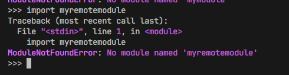
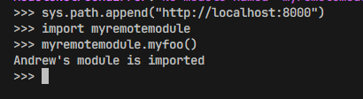

# Лабораторная работа 1. Импорт удаленных модулей.
Выполнил Фролов.А.А.

## Шаг 1. Собственный модуль.
На этом шаге мы создаем свой модуль с функцией заглушкой.

```python
def myfoo():
    print(...)
```

Затем мы создаем файл activation_script.py куда помещаем реализацию хука импорта по URL: загрузчик (loader), искатель (finder) и сам хук, который регистрируется в `sys.path_hooks`.

```python
class URLLoader:
    """Скачивает исходник модуля по URL и выполняет его."""

    def create_module(self, target):
        """None — модуль создаётся стандартным способом."""

    def exec_module(self, module):
        """Качает код по origin и выполняет его в пространстве имён модуля."""


class URLFinder(PathEntryFinder):
    """Знает, какие модули лежат по одному URL-адресу."""

    def __init__(self, url, available):
        """Запоминает базовый URL и набор доступных имён модулей."""

    def find_spec(self, name, target=None):
        """Спецификация модуля с URLLoader, если имя есть по этому URL, иначе None."""


def url_hook(some_str):
    """Для http-элемента sys.path строит URLFinder, иначе ImportError."""


sys.path_hooks.append(url_hook)
```

Запускаем модуль на сервере (`python -m http.server` из каталога `rootserver`), в другом терминале запускаем активирующий скрипт локально в интерактивном режиме (`python -i activation_script.py`), пробуем сделать импорт:


Получаем ошибку `ModuleNotFoundError`: хук уже зарегистрирован, но адреса сервера нет в `sys.path`, поэтому искать модуль по HTTP интерпретатору негде.

Затем выполняем команду
```python
sys.path.append("http://localhost:8000")
```
и пробуем сделать импорт снова.


Все успешно. Теперь для нового элемента `sys.path` срабатывает `url_hook`, он забирает у сервера список файлов и возвращает `URLFinder`; тот отдаёт спецификацию с `URLLoader`, который скачивает и выполняет исходник. Вызов `myremotemodule.myfoo()` печатает `Andrew's module is imported` — код действительно приехал с сервера.
